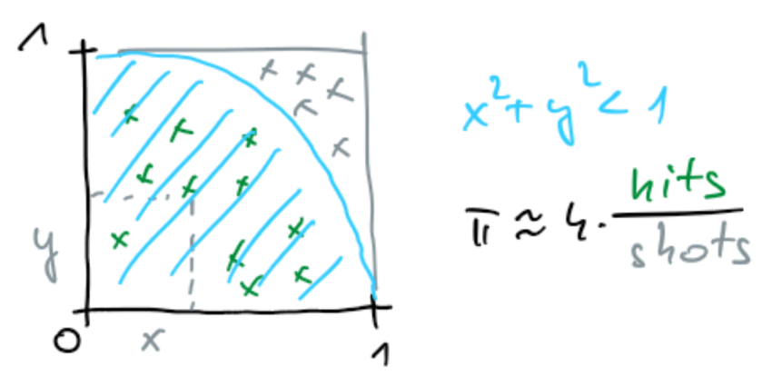

# Programming Patterns

## Pattern-based programming

- Patterns are “best practices” for solving specific problems.
- Patterns re universal, can be applied to any programming system.
- Patterns can be used to organize your code, leading to algorithms that are more scalable and maintainable.
- A pattern supports a particular algorithmic structure with an efficient implementation.  
- Good parallel programming models support a set of useful parallel patterns with low-overhead implementations.
- New patterns can be derived from existing patterns.
- Serial and parallel patterns.

- Focus on algorithm strategy patterns
  - Algorithm skeletons
  - Not design patterns (high level, abstract)
  - Not implementation patterns (low-level, hardware specific)
- Patterns
  - Semantics
    - building blocks, arrangement of tasks, data dependencies
    - design phase
  - Implementation
    - Granularity, good use of cache
    - Focus on data parallelism to ensure scalability

- Task
  - Task is a unit of independent (potentially parallel) work.
  - Tasks are executed by scheduling on software threads
  - Usually cooperative: at predicted switch points
  - Software threads are scheduled by OS onto hardware threads
  - Preemptive approach is most common (at any time)

## Serial Patterns

- Nesting
  - Fundamental compositional pattern
  - Allows for hierarchical composition
  - Any task block in a pattern can be replaced with a pattern with the same input and output configuration and dependencies
  - Nesting is crucial for structured, modular code

- Serial Control Flow Patterns  

  - Sequence

    ```C
    B = f(A);
    C = g(B);
    D = h(B, C);
    ```

    - No data dependencies
    - Data dependencies restrict the order of execution
    - Parallel generalization: superscalar sequence
      - removes code-text order constraint
      - Order tasks only by data dependencies
  - Selection (branch)

    ```C
    if (cond) {
      statementA;
    } else {
      statementB;
    }
    ```

    - Parallel generalization: speculative execution
      - ```cond```, ```statementA```, and ```statementB``` can be executed in parallel
      - ```statementA``` or ```statementB``` is discarded when ```cond```is known

  - Iteration

    ```C
    while (cond) {
      statement;
    }
    ```

    - Countable iteration (for loop) as a special case, important for parallel patterns.
    - Parallel generalization
      - The serial iteration pattern appears in several different parallel patterns: map, reduction, scan, recurrence, scatter, gather, pack
      - Parallel patterns have a fixed number of invocations, known in advance
      - Loop-carried dependencies limit parallelization
      - Problem of hidden data dependencies

        ```C
        for (int i = 0; i < n; i++)
          x[a[i]] = x[b[i]] * x[c[i]] + x[d[i]];
        ```

        ```C
        for (int i = 0; i < n; i++)
          y[a[i]] = x[b[i]] * x[c[i]] + x[d[i]];
        ```

        It seems that there is no dependencies in the second case. But if ```y``` points to the same location as ```x```, the dependencies are the same as in the first case.

    - recursion
      - dynamic nesting which allows functions to call themselves
      - stack memory allocation

  - serial data management patterns

    - random read and write
      - working with pointers, possible aliasing (two pointers refer to the same memory object)
      - aliasing can make vectorization and parallelization difficult
        - undefined result
        - extra object copies reduce performance
        - burden put on a programmer
      - working with array indices is safer and easier to transfer to another platform

    - stack allocation
      - efficient as arbitrary amount of data can be allocated and preserves locality
      - each thread gets its own stack

    - heap allocation
    Heap allocation
      - slower than stack allocation
      - allocation scattered all over memory (matrix allocation)
        - more expensive due to the memory hardware subsystem
      - implicitly sharing the data structure can lead to scalability problems
        - better is to maintain a separate memory pool for each worker and avoid global locks
        - gGet rid of false sharing

## Parallel Pattern: Map

- replicates elemental function over every element of index set
- map replaces iterations of independent loops
- elemental functions should not modify global data that other instances (iterations) depend on
- examples:
  - gamma correction in images, color space conversions
  - Monte Carlo sampling, ray tracing
- map applies an elemental function to every element of a collection of data in parallel
  - elemental functions should have no side effects
  - no dependency among elements
  - can execute in any order
- embarrassingly parallel
  - one of the most efficient patterns
  - if you have many problems to solve, parallel solution can be as simple as running problems (serial code) on parallel execution nodes
- Typically combined with other patterns
  - map does the basic computation, other patters follow
  - gather = serial random read + map, reduction, scan
- serial and parallel execution of the map pattern
- scalable implementation of map
  - a lot of care for best performance
  - threads
    - mandatory parallelism
    - separate thread for each element is not a good idea
  - tasks
    - optional parallelism
    - overhead and synchronization at the beginning and at the end when elemental functions vary in the amount of work
- the map pattern is a basis for vectorization and parallelization
- example: Map-reduce, Google’s big success
- map is related to SIMD, SPMD, SIMT
  - can be expressed as a sequence of vector operations
- parallel for construct in programming languages
  - map is parallelization of the serial iteration pattern where iterations are independent
- if dependencies and side-effects are avoided, map is deterministic

### Monte Carlo Pi

- Integration
  - random shooting to the square

    

  - number of hits - shots inside the circle is proportional to 𝜋/4
  - slow convergence, relative accuracy is 1/\square(shots)
  - a shot is basic unit of work that can be parallelized is one shot
    - a lot of overhead
    - better is to combine several shots to one task

